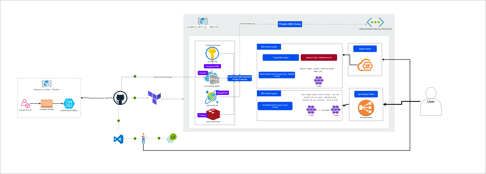
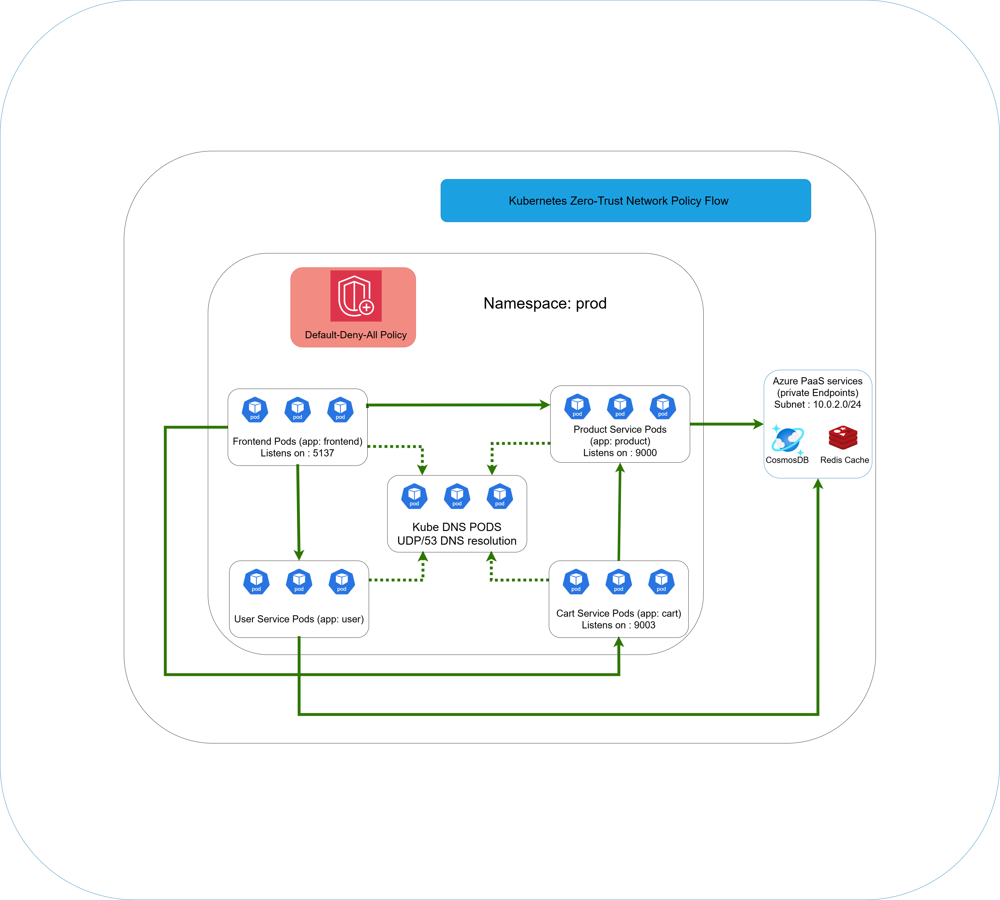

# Cloud-Native E-Commerce Platform on Azure with MERN & Microservices

## Project Transformation & Cloud Architecture

This repository forks a MERN e-commerce application and completely re-architects it for a production-grade deployment on Microsoft Azure. My contributions focus on building a secure, scalable, and fully automated cloud-native infrastructure from the ground up using modern DevOps principles and enterprise-level security.


_Figure 1: This is the complete infrastructure of the application_

### Key Features & Technologies

- **Infrastructure as Code (IaC)** with Terraform for declarative infrastructure management
- **Production-Grade Containerization** with Docker multistage builds and distroless images
- **Secure Orchestration** on Azure Kubernetes Service (AKS) with private cluster configuration
- **End-to-End Security** with Private Link and Zero-Trust Networking
- **Automated Secret Management** with Azure Key Vault and Workload Identity
- **High Availability and Scalability** by design with auto-scaling and multi-zone deployment
- **Network Segmentation** with Kubernetes Network Policies and Azure CNI
- **Disaster Recovery** with geo-redundant Cosmos DB and automated backups

### Infrastructure as Code (Terraform)

The entire Azure infrastructure is defined declaratively using Terraform, ensuring consistency, reproducibility, and version control. The implementation features:

- **Secure Remote Backend**: Terraform state is stored in Azure Storage with private access, ensuring state security and team collaboration
- **Modular Architecture**: Professional structure with reusable modules for networking, private endpoints, and core services
- **Resource Organization**: Clear separation of concerns with dedicated modules for VNet, AKS, private endpoints, and PaaS services

### Containerization (Docker)

The application follows containerization best practices with a multi-service architecture:

- **Multistage Builds**: Optimized production images with minimal attack surface
- **Distroless Images**: Node.js backend services use Google's distroless base images for enhanced security
- **Lightweight Frontend**: React application served via Nginx for optimal performance
- **Security Hardening**: Non-root user execution and minimal dependencies in production containers
- **Health Checks**: Built-in container health monitoring for Kubernetes orchestration

### Orchestration (Azure Kubernetes Service - AKS)

The containerized services are deployed on a production-hardened AKS cluster with enterprise-grade configuration:

- **Private Cluster**: Kubernetes API server is not exposed to the public internet
- **Dual Node Pools**:
  - System node pool for critical cluster services (tainted for system pods only)
  - User node pool for application workloads with auto-scaling capabilities
- **Azure CNI Networking**: Pods receive IP addresses directly from the VNet subnet (didn't need to create overlay pod_cidr since I have a huge pool of IPs available)
- **Workload Identity**: Secure authentication between pods and Azure services through service account
- **Horizontal Pod Autoscaler (HPA)**: Automatic scaling based on CPU and memory metrics
- **Pod Disruption Budgets**: Ensures service availability during maintenance operations


_Figure 2: Workload Identity - Secure AKS Integration with Azure Key Vault and Private Link Services_

### Security Posture (Zero-Trust by Design)

The infrastructure implements a comprehensive zero-trust security model:

#### Private Network Architecture

- **Isolated VNet**: All resources operate within a private Azure Virtual Network
- **Subnet Segmentation**: Dedicated subnets for AKS, applications, private endpoints, and bastion services
- **Private AKS Cluster**: Kubernetes API server accessible only through private endpoints
- **Azure Bastion**: Secure administrative access without exposing management ports

#### Private Link Integration

- **Private Endpoints**: All Azure PaaS services (ACR, Cosmos DB, Redis Cache, Key Vault) accessible only through private IP addresses
- **Private DNS Zones**: Automatic DNS resolution to private endpoints, ensuring no public internet exposure
- **Azure Backbone**: All inter-service communication traverses Microsoft's private network infrastructure

#### Secret Management

- **Azure Key Vault**: Centralized secret storage with encryption at rest and in transit
- **Secrets Store CSI Driver**: Kubernetes-native secret injection without storing secrets in etcd
- **Workload Identity**: Fine-grained Azure AD authentication for pods to access Key Vault
- **Automatic Secret Rotation**: Built-in secret rotation capabilities for enhanced security

#### Zero-Trust Networking


_Figure 3: a zero-trust networking model is enforced within AKS, ensuring all services are private by default_

- **Kubernetes Network Policies**: Deny-by-default network segmentation at the pod level
- **Micro-segmentation**: Explicit allow rules for required communication paths only
- **Service-to-Service Authentication**: Secure communication between microservices
- **DNS-based Service Discovery**: Internal service resolution without external dependencies

### How to Deploy

The infrastructure deployment follows a two-step process:

1. **Bootstrap the Terraform Backend** (one-time setup):

   ```bash
   cd terraform
   terraform init
   terraform apply
   ```

2. **Deploy the Main Infrastructure**:
   ```bash
   cd terraform
   terraform init
   terraform plan
   terraform apply
   ```

The deployment will provision:

- Azure Resource Group and Virtual Network
- Private AKS cluster with dual node pools
- Azure Container Registry with private access
- Cosmos DB for MongoDB with geo-replication
- Redis Cache for session management
- Azure Key Vault for secret management
- Private endpoints for all PaaS services
- Kubernetes manifests for application deployment

### Technology Stack

| Application Stack    | Infrastructure & DevOps Stack |
| :------------------- | :---------------------------- |
| React (Vite)         | Microsoft Azure               |
| Node.js / Express.js | Terraform (IaC)               |
| MongoDB              | Kubernetes (AKS)              |
|                      | Docker & Nginx                |
|                      | Azure Key Vault               |
|                      | Azure Private Link            |
|                      | GitHub Actions (CI/CD)        |

## Contributers

- [Ahmed Azzam](https://github.com/AhmedAzzam-Web)
- [Thomas Maged](https://github.com/Tomas-Maged)
- [Maximous Atef](https://github.com/Maxiatef)
- [Kirollos Nessim](https://github.com/KirollosNessem)
- [Ramez Hesham](https://github.com/RamezHesham)
- [Yara Wael](https://github.com/yara880)
- [Nourhane Amir](https://github.com/NourhaneAmir)
